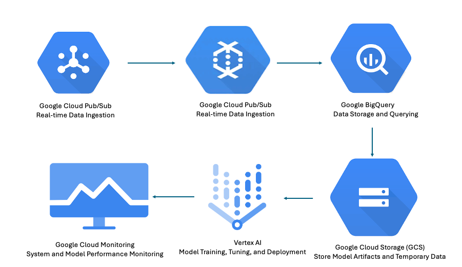

# HeatEx FanGuard: Predictive Maintenance System

## Overview

**HeatEx FanGuard** is a predictive maintenance system designed to monitor and predict potential failures in heat exchange systems using IoT sensor data. The project leverages **Google Cloud Platform (GCP)** services for real-time data ingestion, processing, machine learning, and deployment. The system aims to reduce maintenance costs, prevent downtime, and optimize the operation of industrial equipment.

## Business Problem

Heat exchange systems are critical components in various industries, including manufacturing, chemical processing, and HVAC systems. Unexpected failures in these systems can lead to significant financial losses, safety hazards, and operational disruptions. **HeatEx FanGuard** addresses this problem by predicting potential failures before they occur, enabling proactive maintenance.

## Solution Approach

1. **Data Ingestion**: IoT sensor data is ingested in real-time using **Google Cloud Pub/Sub**.
2. **Data Processing**: A **Google Cloud Dataflow** job processes the data, performs transformations, and stores it in **BigQuery**.
3. **Model Development**: Multiple machine learning models (**Random Forest**, **Gradient Boosting**) are trained on the processed data with hyperparameter tuning.
4. **Model Deployment**: The best models are deployed to **Vertex AI** for real-time predictions.
5. **Monitoring and Alerting**: The system is monitored using **Google Cloud Monitoring**, and alerts are set up for anomalies and performance issues.

## Key Features

- **Real-Time Data Processing**: Utilizes Google Cloud Dataflow for real-time processing of sensor data.
- **Advanced Machine Learning Models**: Implements Random Forest and Gradient Boosting models with hyperparameter tuning.
- **Model Versioning and Management**: Deploys models with version control on Vertex AI.
- **Scalable and Automated Pipeline**: Provides end-to-end automation from data ingestion to deployment and monitoring.
- **Alerting and Monitoring**: Tracks model performance and system health using Google Cloud Monitoring.

## Architecture



The architecture consists of the following components:
- **Google Cloud Pub/Sub**: For real-time data ingestion.
- **Google Cloud Dataflow**: For real-time data processing and feature engineering.
- **Google BigQuery**: For storing processed data and training datasets.
- **Google Cloud AI Platform (Vertex AI)**: For model training, deployment, and management.
- **Google Cloud Storage (GCS)**: For storing model artifacts and temporary data.
- **Google Cloud Monitoring**: For monitoring model performance and system health.

## Prerequisites

- **Google Cloud Platform account** with billing enabled.
- **GCP SDK** installed and configured.
- **Python 3.x** installed with necessary libraries:
  - `pandas`
  - `numpy`
  - `google-cloud`
  - `sklearn`
  - `apache-beam`

## Getting Started

### 1. Clone the Repository

```bash
git clone https://github.com/mrachana19/heatex-fanguard.git
cd HeatEx-FanGuard
```

### 2. Set Up Google Cloud Services

- Enable the required GCP APIs:
  - Pub/Sub
  - Dataflow
  - BigQuery
  - Vertex AI
  - Cloud Storage
  - Cloud Monitoring

- Set up Pub/Sub topic and subscription:
  - Create a topic: `sensor-data-topic`
  - Create a subscription: `sensor-data-subscription`

- Set up a BigQuery dataset: `sensor_data_analysis`

### 3. Publish Sensor Data to Pub/Sub

```bash
python heatex_fanguard_pipeline.py --task publish_data
```

### 4. Run Dataflow Job

```bash
python heatex_fanguard_pipeline.py --task run_dataflow
```

### 5. Train and Deploy Models

```bash
python heatex_fanguard_pipeline.py --task train_and_deploy
```

## Detailed Documentation

For a detailed explanation of the project, including the business context, data pipeline, model development, and deployment strategy, please refer to the [HeatEx FanGuard Detailed Documentation](HeatEx_FanGuard_Detailed_Documentation.pdf).


## Acknowledgments

- **Google Cloud Platform** for providing cloud infrastructure and services.
- **OpenAI** for supporting the development of machine learning models.

## Contact

For any questions, please contact Rachana Mahapatra(mailto:rachanamahapatra197@gmail.com).

